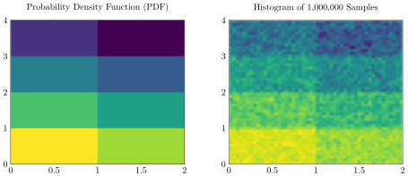

# GridDensities

[](https://travis-ci.org/sisl/GridDensities.jl)
[](https://codecov.io/gh/sisl/GridDensities.jl)
[](https://coveralls.io/repos/sisl/GridDensities.jl?branch=master)

This packages allows users to define a piecewise uniform density over a hypergrid and draw samples from it.

The figure below shows an example defined on a two-dimensional grid. The left half of the figure shows a plot of the probability density function (pdf) and the left half of the figure shows a two-dimensional histogram of 1,000,000 samples.



## Installation

Start Julia and run the following command:

```julia
Pkg.add("GridDensities")
```

## Usage

To use the GridDensities module, begin your code with

```julia
using GridDensities
```

## Defining a Grid Density

A grid density is defined by calling `d = GridDensity(data, lo, hi, bins)` where `data` is the relative density within each grid cell (does not need to be normalized), `lo` is a vector of lower bounds for each dimension, `hi` is a vector of upper bounds for each dimension, and `bins` is a vector containing the number of bins for each dimension. The following line will create the density shown in the figure above.

```julia
d = GridDensity(collect(1:8), [0.0, 0.0], [2.0, 4.0], [2, 4])
```

## Evaluating the Probability Density Function (PDF)

To evaluate the probability density function of grid density `d` and at point `x`, run:

```julia
prob_density = pdf(d, x)
```

## Sampling

To draw a sample from the distribution for grid density `d`, run:

```julia
sample = rand(d)
```

To draw `n` samples from the distribution for grid density `d`, run:

```julia
samples = rand(d, n)
```

## Credits

Contributors to this package include Mykel Kochenderfer and Sydney Katz.
